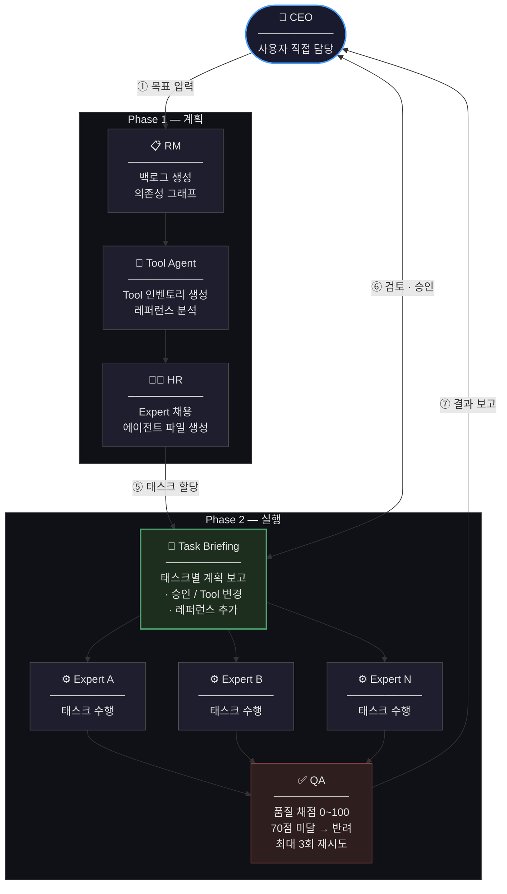

# AI Company

**AI 에이전트들이 역할을 분담하여 자율적으로 운영되는 가상의 회사 (Multi-Agent Organization)**

> 하나의 AI 에이전트가 인간 전문가를 대체할 수 있다면,
> **단 한 명의 사용자(CEO)와 HR 에이전트만으로도 하나의 회사를 운영할 수 있지 않을까?**

[Claude Code](https://claude.ai/code) | [Rube MCP](https://rube.app/marketplace) 

본 프로젝트는 [Claude Code](https://claude.ai/code) 기반의 Skills, Subagent 아키텍처와 Rube MCP 연동을 통해, 명확한 역할과 책임을 가진 AI 에이전트들이 조직 단위로 문제를 해결하고 실행하는 프레임워크입니다.

---

## 🚀 Motivation

단발성 질의응답이나 코드 생성에 머무는 기존 AI 활용의 한계를 넘어, **복합적인 문제 해결과 장기적인 프로젝트 운영이 가능한 AI 협업 모델**을 검증하기 위해 시작되었습니다. 

본 프로젝트는 에이전트 간의 협업, 의사결정 구조, 그리고 통제 가능한 확장 방식을 설계하여, 단순한 챗봇을 넘어선 **실행 가능한 에이전틱(Agentic) 조직**을 구현합니다.

---

## 🎯 Architecture Overview

사용자는 **CEO**의 역할을 수행하며, 최종 목표만 시스템에 전달합니다. 이후의 과정은 에이전트 조직에 의해 자율적으로 분해, 할당, 실행됩니다.

1. **목표 입력:** CEO(사용자)가 목표를 제시.
2. **태스크 분해:** RM(Resource Manager)이 목표를 분석하여 백로그 생성 및 의존성 그래프 도출.
3. **환경 검증:** Tool Agent가 현재 가용한 도구와 외부 API 인벤토리 구성.
4. **팀 빌딩:** HR 에이전트가 요구 역량에 맞춰 Expert 에이전트 동적 생성 및 할당.
5. **계획 승인 (Human-in-the-loop):** CEO가 태스크별 실행 계획 검토 및 승인.
6. **병렬 실행:** Expert들이 의존성 그래프에 따라 독립된 컨텍스트에서 태스크 병렬 수행.
7. **품질 보증:** QA 에이전트가 결과물 평가(0~100점). 기준 미달 시 자동 피드백 및 재시도(최대 3회).

### Agent Workflow




---

## 🤖 Agent Roles

모든 에이전트는 **독립된 컨텍스트**에서 실행되어 간섭을 최소화합니다.


| 에이전트             | 역할                                                | 실행 방식         |
| ---------------- | ------------------------------------------------- | ------------- |
| **RM Agent**     | 목표를 프로젝트 > 태스크로 분해하고 의존성 그래프 생성                   | Subagent      |
| **Tool Agent**   | 실행 환경을 능동적으로 탐색하여 가용 Tool 인벤토리 생성 및 레퍼런스 분석       | Subagent      |
| **HR Agent**     | Tool 인벤토리를 기반으로 역량 중심의 Expert 동적 생성 및 할당          | Subagent      |
| **Expert Agent** | 승인된 계획에 따라 외부 서비스 호출 및 실제 태스크 수행                  | Subagent (병렬) |
| **QA Agent**     | 결과물 품질 검증 (0~100점). 70점 미달 시 반려 및 최대 3회 재시도 로직 수행 | Subagent (병렬) |


---

## ⚖️ AI Company vs 일반 AI 도구

AI Company는 수동적인 텍스트 생성을 넘어, 실제 외부 세계와 상호작용하며 결과물을 완성하는 것을 목표로 합니다.

n8n, Zapier 같은 자동화 도구와도 다릅니다. 자동화 도구는 사용자가 **정확한 태스크와 파이프라인을 직접 설계**해야 합니다. 무엇을 할지 알고, 어떤 순서로 할지도 알아야 도구를 쓸 수 있습니다. AI Company는 한 단계 위에서 작동합니다. **목표 또는 KPI만 입력하면**, 에이전트들이 스스로 태스크를 분해하고, 팀을 구성하고, 실행 계획을 수립합니다.


| 구분          | AI Company                       | 일반 AI 도구 (ChatGPT 등)     | 자동화 도구 (n8n, Zapier 등) |
| ----------- | -------------------------------- | ------------------------ | ---------------------- |
| **사용자 입력**  | **목표 / KPI**                     | 구체적인 질문 또는 명령            | 정확한 태스크 + 파이프라인 직접 설계  |
| **계획 수립**   | 에이전트가 **자동으로 분해 및 설계**           | 계획 문서 제공                 | 없음 (사용자가 플로우 작성)       |
| **목표 단위**   | **조직 단위**의 복합적 문제 해결             | 개별적, 단발성 작업 수행           | 사전 정의된 단위 작업의 반복 자동화   |
| **에이전트 확장** | HR 에이전트에 의한 **동적 채용 및 할당**       | 고정된 단일/소수 에이전트           | 고정된 액션 노드              |
| **실행 투명성**  | Task Briefing을 통한 **사전 검토 및 승인** | 실행 완료 후 결과만 확인           | 트리거 후 자동 실행 (개입 어려움)   |
| **작업 처리**   | 의존성 그래프 기반 **자동 병렬 처리**          | 순차적 텍스트/코드 생성            | 노드 연결 순서에 따른 순차 실행     |
| **품질 보증**   | QA 에이전트의 **자동 검증 및 재시도 (최대 3회)** | 사용자가 직접 결과물 검증 및 프롬프트 수정 | 없음                     |


---

## ✨ Core Features

### 1. 능동적 실행 인프라 (Agentic Execution)

수동적인 제안에 그치지 않고, 에이전트가 직접 도구를 선택하고 외부 서비스를 호출하여 실제 결과물을 생성합니다.

- **Tool Discovery:** Tool Agent가 내장 도구, 설치된 스킬, 외부 API 가용성을 사전에 검증하여 '실제 실행 가능한' 계획만 수립합니다.
- **Rube MCP 연동:** 수많은 외부 서비스(Gmail, Slack, Google Sheets, Instagram 등)를 MCP(Model Context Protocol)로 연결하여 실제 세계와의 상호작용을 지원합니다.

### 2. 제어 가능한 자율성 (Interactive Execution)

완전 자율 주행의 위험성을 방지하기 위해 중요 분기점(Task Briefing)마다 CEO(사용자)의 검토와 개입을 허용합니다. 실행 전 Tool을 변경하거나 추가 지시사항을 주입할 수 있습니다.

---

## 🛠 Getting Started

### Prerequisites

- Node.js 및 npm
- Claude Code CLI (`npm install -g @anthropic-ai/claude-code`)
- (선택) 외부 서비스 연동을 위한 [Rube 계정](https://rube.app)

### Installation & Execution

**1. Repository Clone**

```bash
git clone [https://github.com/qlqlrh/ai_company.git](https://github.com/qlqlrh/ai_company.git)
cd ai_company
```

**2. Claude Code 실행**

```bash
claude
```

**3. 오케스트레이터 시작**

```bash
/ai-company
```

CEO로서 목표를 입력하면 에이전트들이 계획 수립 및 실행 파이프라인을 가동합니다.

---

## 🔗 External Integrations (Rube MCP)

AI Company는 `rube.app`의 MCP 서버를 통해 다양한 SaaS 및 외부 서비스와 통신합니다. 프로젝트 루트의 `.mcp.json` 파일에 기본 설정이 포함되어 있습니다.


| 카테고리        | 연동 가능한 주요 앱                 |
| ----------- | --------------------------- |
| **커뮤니케이션**  | Gmail, Slack, Discord       |
| **프로젝트 관리** | Jira, Asana, Linear, Notion |
| **데이터 연동**  | Google Sheets, Airtable     |
| **SNS/마케팅** | Instagram, X(Twitter)       |
| **멀티미디어**   | Gemini, Canva               |
| **저장소**     | GitHub, GitLab              |


---

## 📂 Repository Structure

```text
ai_company/
├── .mcp.json            # Rube MCP 설정
├── .claude/
│   ├── agents/          # 에이전트 프롬프트 및 정의 파일
│   ├── skills/          # 유틸리티 스킬 (오케스트레이터 포함)
│   └── CLAUDE.md        # Claude Code 작업 가이드라인
├── company/
│   ├── state/           # 상태 관리 파일 (JSON)
│   └── outputs/         # 에이전트 실행 결과물 산출 디렉토리
└── docs/
    ├── design-system.md # 시각 디자인 공유 규칙
    └── specs/           # 설계 및 기획 문서
```

---

## 📚 Documentation

상세한 아키텍처 및 구현 로직은 아래 문서를 참고하세요.

- [v4 워크플로우 상세 설계](docs/specs/interactive-execution-workflow-v4.md)
- [구현 이력 및 개선 기록 (v5)](docs/specs/implementation-plan-v5.md)
- [Tool 발견 전략 설계](docs/specs/tool-discovery-strategy.md)
- [Subagent 아키텍처 선택 근거 (에이전트 팀 기능 미사용 이유)](docs/specs/에이전트%20팀%20기능%20안%20쓴%20이유.md)
- [시각 디자인 규칙 (QA 검증 기준)](docs/design-system.md)
- [Claude Code 작업 가이드](.claude/CLAUDE.md)

